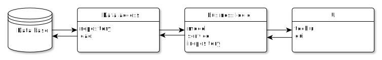

# Сеть платных автопарковок

### Запуск проекта

```bash
cd /binary
java -cp "_BL.jar;_DA.jar;_TechUI.jar" tui.Main
```

### Краткое описание идеи проекта

Приложение для сети автопарковок позволяет пользователям получать информацию о количестве свободных мест на парковках, покупать абонемент, бронировать парковочные места, въезжать на парковку и оплачивать ее с помощью телефона, не используя бумажные талоны.

### Краткое описание предметной области

Предметная область данного проекта – автопарковки, транспортные средства, паркоматы.

###  Краткий анализ аналогичных решений

В настоящий момент уже существует несколько приложений платных парковок. Далее приведен их анализ по указанным критериям.

|                                        | Парковки Москвы | Came Vector | Квазар |
| :------------------------------------: | :-------------: | :---------: | :----: |
|           Возможность брони            |       нет       |     нет     |  нет   |
| Информация о количестве свободных мест |       нет       |     да      |  нет   |
|         Оформление абонемента          |       да        |     нет     |  нет   |
|       Оплата с помощью телефона        |       нет       |     нет     |  нет   |

В результате, ни одно из рассмотренных приложений не удовлетворяет всем критериям.

### Целесообразность и актуальность проекта

Актуальность проекта определяется постоянным ростом числа транспортных средств и острой нехваткой парковочных мест. Поиск свободных парковок не только доставляет неудобство автовладельцем, но и приводит к загруженности дорог и аварийным ситуациям. Возможность получить информацию о наличии свободных мест, а также возможность забронировать заранее парковочное место значительно облегчает планирование передвижений жителей городов и мегаполисов.

### Use-Case


### ER-диаграмма в нотации Чена


### Описание акторов

В проекте представлены следующие акторы:

1. Пользователь – может покупать абонемент, оплачивать и бронировать парковочные места;
3. Паркомат – аппарат для выдачи талона на стоянку;
4. Сотрудник – может получить информацию о том, на какой парковке работает и свой оклад;
5. Администратор – создает, редактирует, удаляет сотрудников и парковки;
6. Гость – незарегистрированный пользователь, которому доступен только список парковок.

### Пользовательские сценарии

- Бронирование парковочного места:
  1. Пользователь выполняет поиск интересующей его парковки;
  3. Выбирает время, до которого необходимо удерживать место;
  4. Совершает оплату брони.
- Выдача талона на парковку:
  1. Пользователь подъезжает на парковку;
  2. Паркомат считывает QR-код пользователя с телефона;
  3. Аппарат получает информацию о свободных и забронированных  местах на парковке;
  4. Выдает талон;
  5. Фиксирует время начала парковки;
  6. Пользователь въезжает на парковку.
- Оплата парковки:
  1. Пользователь дает системе считать свой QR-код с телефона;
  2. Паркомат фиксирует время окончания парковки;
  3. Считает время нахождения пользователя на парковки;
  4. Рассчитывает итоговую стоимость с учетом тарифа парковки и абонемента пользователя;
  5. Производит оплату;
  6. Пользователь покидает парковку.

### BPMN


## Технологический стек

- Тип приложения: mobile + backend;
- язык: Java / Kotlin;
- СУБД: PostgreSQL.

### Верхнеуровневое разбиение на компоненты

Приложение будет состоять из 3 компонентов:

- компонент реализации UI;
- компонент реализации бизнес-логики (Business Logic);
- компонент доступа к данным (Data Access).



## UML диаграмма классов


